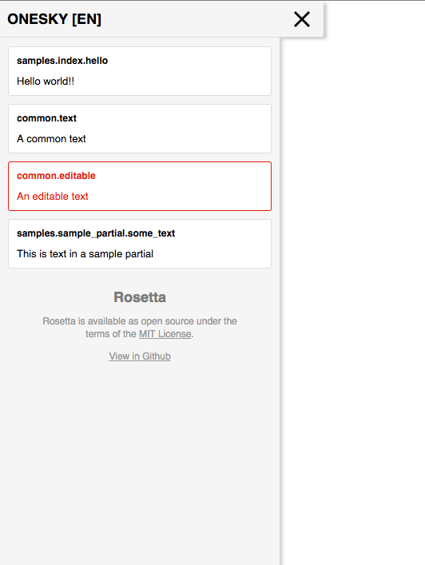

# Rosetta

[](https://travis-ci.org/MarsBased/rosetta)

Rosetta is a library for Rails that helps you identify translations used on your app pages. The library adds an expandable menu to each page showing all phrases being used in the page along with additional info depending on the [Repository](#repositories) used. When using the [Database repository](#database-repository) translations can also be edited directly from the menu. 

It also adds a page to list all translations available in the app, including those from gems. The list includes all the same goodies for each translation.



## Why use Rosetta?

When using regular translations (Local repository), Rosetta shows the file where each translation is. This is useful to more easily find translations and edit them, and to find translations from gems.

However, Rosetta is most useful when using either the Onesky or the Database repository.

When using the [OneSky translation service](https://www.oneskyapp.com/), it gives you direct links to edit the translations on OneSky. This makes it easy for copy writers of your app to see the texts in context and edit the translations directly.

When using the [Database repository](#database-repository), along with [I18n::Backend::ActiveRecord](https://github.com/svenfuchs/i18n-active_record) back-end for I18n, it offers a way to see translations stored in the database and allows you to edit them directly. This can be used by copy writers of your app to update translations on the fly without needing to restart the web servers.

## Dependencies

Rosetta requires a Ruby version >= 2.3 and I18n >= 1.1.0. 

It has only been tested with Rails 5.X but it may work with earlier versions (along with I18n version 1.1.0 or greater).

## Repositories

The phrases menu is different depending on the way you manage your translations. There are currently 3 repositories: Local (default), OneSky and Database

### Local Repository

This is the default repository and shows translations managed manually via YML files. It shows the file where each translation is stored to be able to easily find it.

It requires no further configuration.

### OneSky repository

Use this repository if you manage your translations using the [OneSky translation service](https://www.oneskyapp.com/). It adds a link to each translations pointing to the edit page for that text in OneSky.

It requires 2 configuration options:
* subdomain
* project_id

### Database repository

Use this repository if you use the [I18n::Backend::ActiveRecord](https://github.com/svenfuchs/i18n-active_record) for I18n, which stores translations in the database.

When using the database repository, translations can be edited directly from the phrases menu. If a translation is not stored in the database, it will be created and if it's already present it will be updated.

## Translations page

This page shows a list with all the translations found for the locale passed as a parameter and offers the same goodies for each of the translation like the phrases menu. If you are using the database repository, for instance, it allows to edit translations.

## Installation
Add this to your Gemfile:

```ruby
gem 'rosetta', '~> 1.0'
```

and run the `bundle install` command.

To generate the initializer file run `rails g rosetta:install`. In the initializer you can choose and configure the repository.

## Getting Started

### 1. Enable the library

By default, Rosetta is disabled. You need to explicitly enable it when desired. Usually that will depend on the current user making the request.

To enable it in a per-request basis add a `before_action :enable_rosetta` to the desired controller and add an `if` condition if necessary. Example:

```ruby
before_action :enable_rosetta, if: ->() { current_user.admin? }
```

### 2. Render the menu where desired

In order to show the menu with the translations you need to indicate where you want to render it. Usually this will be in your application's layout. Add this at the end of the body of your `layours/application.html.erb`:

```ruby
<%= render rosetta_menu %>
```

### 3. Mount the routes

In order to be able to access the page that lists all translations, you need to mount the routes. Add the following to `routes.rb`

```
mount Rosetta::Engine, at: '/rosetta'
```

The phrases page will be available at `/rosetta/phrases`. You can pass a locale parameter to the page to show the translations from that locale.

In order to protect the routes to, for instance, only be accessible by admins:

```
authenticated :user, ->(user) { user.is_admin } do
    mount Rosetta::Engine, at: '/rosetta'
end
```

## Configuration

You can configure the library through the initializer.

Example:
```ruby
Rosetta.setup do |config|
  # OneSky repository config
  config.repository = Rosetta::Repositories::Onesky.new
  config.repository.project_id = ENV['ONESKY_PROJECT_ID']
  config.repository.subdomain = ENV['ONESKY_SUBDOMAIN']

  # Local repository config
  config.repository = Rosetta::Repositories::Local
end
```

## Development

When first developing, you need to run `bundle install` and `rake db:migrate` to build the database for the dummy app.

Run the specs with `rspec spec`.

Launch the dummy app with `rails s`.

## Credits


Rosetta is maintained and funded by [MarsBased][marsbased]

The names and logos for MarsBased are trademarks of MarsBased.

[marsbased]: http://marsbased.com

## License

The gem is available as open source under the terms of the [MIT License](http://opensource.org/licenses/MIT).
